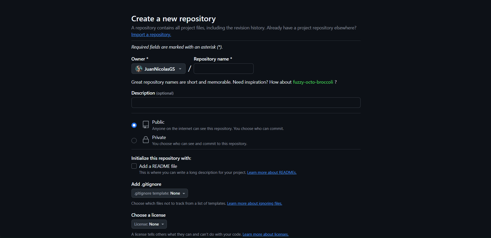
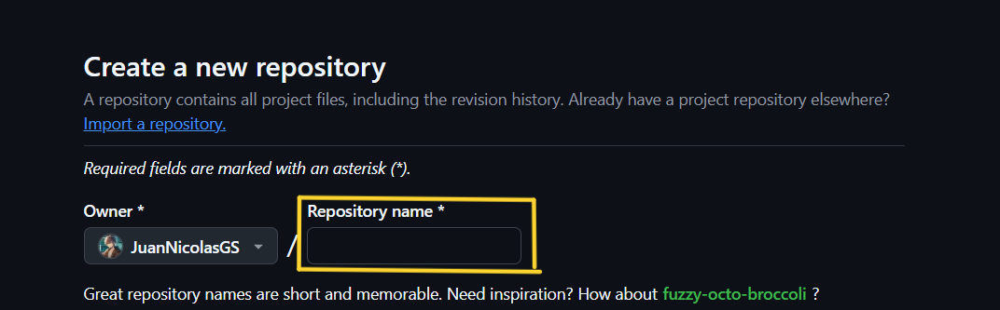
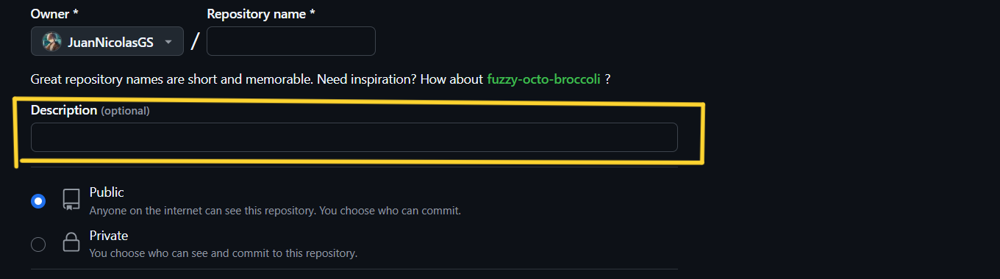

# :beginner: Desvendando Git & GitHub!

## :cloud: Criando Repositório

Tendo em mente que seu ``Git`` já foi devidamente configurado, vamos criar um repositório no ``GitHub`` e estabelecer a conexão dele com sua máquina!

:page_facing_up: Vá até a página inicial do [GitHub](https://github.com/).

 :computer_mouse: Clique no botão verde ``New`` como indicado na imagem abaixo.

:gear: Configure o seu repositório. 

:keyboard: Dê um ``nome`` para seu Repositório. Evite espaços e acentos!

:bulb: Você também pode fazer uma ``descrição`` para seu projeto. Isso é opcional!

## :gear: Comandos Git

Existem alguns comandos para conectar remotament o repositório com a máquina. Vou mostrar a sequência para um repositorio criado do 0 e também a sequência para um projeto em andamento, ou seja com arquivos locais ja criados que ainda não estão no GitHub.

:bulb: Os códigos da imagem abaixo são apenas exemplos:

