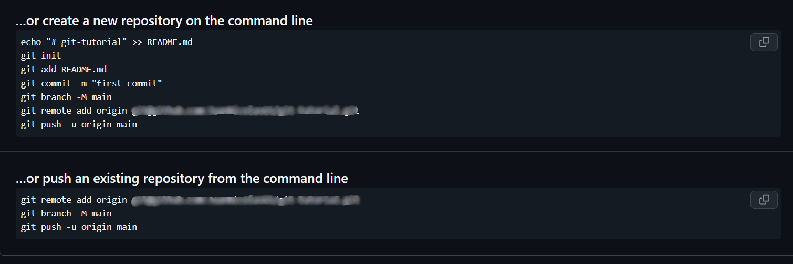

# :beginner: Desvendando Git & GitHub!

## :cloud: Criando Repositório

Tendo em mente que seu ``Git`` já foi devidamente configurado, vamos criar um repositório no ``GitHub`` e estabelecer a conexão dele com sua máquina!

:page_facing_up: Vá até a página inicial do [GitHub](https://github.com/).

 :computer_mouse: Clique no botão verde ``New`` como indicado na imagem abaixo.

:gear: Configure o seu repositório. 

:keyboard: Dê um ``nome`` para seu Repositório. Evite espaços e acentos!

:bulb: Você também pode fazer uma ``descrição`` para seu projeto. Isso é opcional!

## :wrench: Comandos Git

Existem alguns comandos para conectar remotament o repositório com a máquina. Vou mostrar a sequência para um repositorio criado do 0 e também a sequência para um projeto em andamento, ou seja com arquivos locais ja criados que ainda não estão no GitHub.

:bulb: Os códigos da imagem abaixo são apenas exemplos:

### :wrench: Comandos de um Repositório Novo!

    echo "# titulo-do-projeto" >> README.md
    git init
    git add README.md
    git commit -m ":tada: First Commit"
    git branch -M main
    git remote add origin git@github.com:seu-username/seu-projeto.git
    git push -u origin main

### :wrench: Comandos de um Repositório Existente!

    git remote add origin git@github.com:seu-username/seu-projeto.git
    git branch -M main
    git push -u origin main

# :coffee: Principais Comandos Básicos do Git:

### :coffee:Git Clone

"Git clone é uma comando para baixar o código-fonte existente de um repositório remoto (como, por exemplo, o Github). Em outras palavras, git clone, basicamente, faz uma cópia idêntica da versão mais recente de um projeto em um repositório e a salva em seu computador."

    git clone

### :coffee: Git Branch

"Branches (algo como ramificações, em português) são altamente importantes no mundo do git. Usando as branches, vários desenvolvedores conseguem trabalhar em paralelo no mesmo projeto simultaneamente. Podemos usar o comando git branch para criar, listar e excluir as branches."

"Esse comando criará uma branch em seu local de trabalho. Para fazer o push (algo como enviar) da nova branch para o repositório remoto, você precisa usar o comando a seguir:"

    git branch <nome-da-branch>

### :coffee: Git Checkout

"Esse também é um dos comandos do Git mais usados. Para trabalhar em uma branch, primeiro, é preciso "entrar" nela. Usamos git checkout, na maioria dos casos, para trocar de uma branch para outra. Também podemos usar o comando para fazer o checkout de arquivos e commits."

    git checkout <nome-da-branch>

### :coffee: Git Status

"O comando git status nos dá todas as informações necessárias sobre a branch atual."

    git status

### :coffee: Git Add

"Ao criarmos, modificarmos ou excluirmos um arquivo, essas alterações acontecerão em nosso espaço de trabalho local e não serão incluídas no próximo commit (a menos que alteremos as configurações)."

"Precisamos usar o comando git add para incluir as alterações de um ou vários arquivos em nosso próximo commit."

    git add <arquivo>

ou

    git add .

:bulb: o "git add ." incluirar todas as alterações para o próximo commit

### :coffee: Git Commit

"Talvez esse seja o comando mais usado do Git. Quando chegamos a determinado ponto em desenvolvimento, queremos salvar nossas alterações (talvez após uma tarefa ou resolução de problema específica)."

"Git commit é como definir um ponto de verificação no processo de desenvolvimento. Você pode voltar a esse ponto mais tarde, se necessário."

"Também precisamos escrever uma mensagem breve para explicar o que desenvolvemos ou alteramos no código-fonte." [:bulb:Padrões-de-commit:bulb:](https://github.com/iuricode/padroes-de-commits).

    git commit -m "mensagem do commit"

### :coffee: Git Push

"Após fazer o commit de suas alterações, a próxima coisa a fazer é enviar suas alterações ao servidor remoto. Git push faz o upload dos seus commits no repositório remoto."

    git push <repositório-remoto> <nome-da-branch>

"Entretanto, se a sua branch foi recém-criada, também é preciso fazer o upload da branch com o seguinte comando:"

    git push -u origin <nome-da-branch>

### :coffee: Git Pull

"O comando git pull é usado para obter as atualizações de um repositório remoto. Esse comando é uma combinação de git fetch e git merge, o que significa que, quando usamos git pull, ele recebe as atualizações do repositório remoto (git fetch) e aplica imediatamente as alterações mais recentes em seu espaço de trabalho local (git merge)."

    git pull <repositório-remoto>

### :coffee: Git Revert

"Às vezes, precisamos desfazer as alterações que fizemos. Existem várias maneiras de se desfazer as alterações em nosso espaço de trabalho local ou remotamente (dependendo do que você necessita), mas devemos usar esses comandos com cuidado para evitar exclusões indesejadas."

    git revert <codigo-hash-do-commit>

### :coffee: Git Merge

"Quando você concluir o desenvolvimento em sua branch e quando tudo funcionar bem, a etapa final é fazer o merge (mesclar ou unir, em português) da branch com a branch pai (dev ou master/main, em geral). Isso é feito com o comando ``git merge``"

"Git merge, basicamente, integra sua branch com o recurso e todos os seus commits na branch de desenvolvimento (dev) ou na branch principal (master ou main). É importante lembrar que, primeiro, você precisa estar na branch específica na qual você quer fazer o merge de sua branch com o recurso."

    git merge <nome-da-branch-com-o-recurso>

# :copyright: CRÉDITOS

### Informações sobre os comandos: [:copyright: FreeCodeCamp](https://www.freecodecamp.org/portuguese/news/10-comandos-do-git-que-todo-desenvolvedor-deveria-conhecer/)
### Emojis usados para ilustrar: [:copyright:  Emoji-Cheat-Sheet](https://github.com/ikatyang/emoji-cheat-sheet/blob/master/README.md)